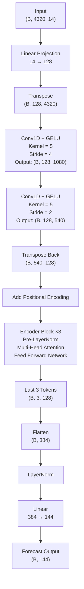

# Project Overview

This project features a hand-built transformer implementation from scratch. Core features implemented manually:

- Sinusoidal Encodings
- Multi-Head Attention class
- Embedding Model class
- Encoder Blocks class
- Custom Dataset Class

## Implementation Summary

|         |                                                                                                                         |
| ---------------------- | ----------------------------------------------------------------------------------------------------------------------------------- |
| **Task**               | Direct Multi-Step Weather Forecasting                                                                                               |
| **Framework**          | PyTorch                                                                                                                             |
| **Architecture**       | Transformer Encoder + Conv1D Downsampler                                                                                                               |
| **Input Window**       | 4320 timesteps                                                                                                                       |
| **Output Horizon**     | 144 timesteps                                                                                                                       |
| **Forecasting Type**   | Non-Autoregressive                                                                                                                  |
| **Dataset**            |Jena Climate dataset                                                                                            |
| **Features**           | Temperature, Humidity, Pressure, Wind Speed, Wind Direction, etc.                                                                   |
| **Core Components**    | Linear Projection, Sinusoidal Positional Encoding, Multi-Head Self-Attention, Feed-Forward Network, LayerNorm, Residual Connections |
| **Loss Function**      | Mean Squared Error (MSE)                                                                                                            |
| **Evaluation Metrics** | MAE, RMSE, R² Score                                                                                                                 
| **Objective**          | Learn long-range temporal dependencies for efficient direct multi-horizon forecasting.                                              |

## Model Architecture

### Compact stage table

| Stage | Operation | Shape before | Shape after |
|---|---|---|---|
| Raw input | — | `(B, 4320, 14)` | `(B, 4320, 14)` |
| Input proj | `Linear(14,128)` | `(B, 4320, 14)` | `(B, 4320, 128)` |
| Prep for conv | `transpose(1,2)` | `(B, 4320, 128)` | `(B, 128, 4320)` |
| Conv1 | `Conv1d(..., stride=4)` | `(B, 128, 4320)` | `(B, 128, 1080)` |
| Conv2 | `Conv1d(..., stride=2)` | `(B, 128, 1080)` | `(B, 128, 540)` |
| Back to seq | `transpose(1,2)` | `(B, 128, 540)` | `(B, 540, 128)` |
| MHA internals | Split heads / attention / merge | `(B, 540, 128)` | `(B, 540, 128)` |
| Encoder stack | 3 × (Pre-LN MHA + FFN) | `(B, 540, 128)` | `(B, 540, 128)` |
| Readout | `x[:, -3:, :]` | `(B, 540, 128)` | `(B, 3, 128)` |
| Flatten | `Flatten()` | `(B, 3, 128)` | `(B, 384)` |
| Decoder | `LayerNorm(384) -> Linear(384,144)` | `(B, 384)` | `(B, 144)` |

---
## Results

### Overall Performance

| **Metric**              |    **Value** |
| ----------------------- | -----------: |
| MAE                     | **1.825 °C** |
| RMSE                    | **2.417 °C** |
| R² Score                |   **0.8914** |
| Correlation Coefficient |   **0.9446** |

### Error Distribution

| **Statistic** |    **Value** |
| ------------- | -----------: |
| Best MAE      | **0.382 °C** |
| Median MAE    | **1.597 °C** |
| Mean MAE      | **1.825 °C** |
| Worst MAE     | **7.228 °C** |

### Error Analysis

| **MAE Threshold**      | **Samples** |
| ---------------------- | ----------: |
| > 1 °C                 |        1305 |
| > 2 °C                 |         514 |
| > 3 °C                 |         175 |
| > 4 °C                 |          49 |
| > 5 °C                 |          13 |
| > 6 °C                 |           4 |
| **Total Test Samples** |    **1548** |
